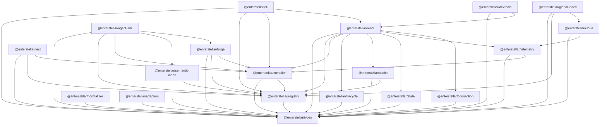

## Overview

Enterstellar is a **Turborepo monorepo** with 24+ packages under `packages/` and 3 apps under `apps/`. Packages are versioned independently (Babel model, managed with Changesets). `@enterstellar/types` is always a peer dependency — never a bundled one.

---

## Dependency Graph



**Key structural rules (L15, enforced by CI):**
- All edges in the engine zone (everything except `react`, `devtools`, `cli`) are framework-free — no `react`, `react-dom`, or `react-native` imports allowed.
- `@enterstellar/types` is always a peer dep, never bundled.
- `@enterstellar/react` is the only package that imports all engine packages as regular dependencies (RE1, RE2 locked).

---

## Package Classification

| Package | NPM Name | Status | Layer | Consumer |
|:---|:---|:---:|:---|:---|
| `types` | `@enterstellar/types` | **Public** | Foundation | Every package |
| `registry` | `@enterstellar/registry` | **Public** | Layer 1 | App developers |
| `compiler` | `@enterstellar/compiler` | **Public** | Layer 2 | Advanced users |
| `cache` | `@enterstellar/cache` | **Public** | Layer 3 | Advanced users |
| `lifecycle` | `@enterstellar/lifecycle` | **Internal** | Layer 4 | `react` only |
| `normalizer` | `@enterstellar/normalizer` | **Internal** | Layer 1 | `react`, `agent-sdk` |
| `semantic-index` | `@enterstellar/semantic-index` | **Internal** | Layer 1 | `registry`, `agent-sdk` |
| `forge` | `@enterstellar/forge` | **Internal** | Layer 1b | `react`, `agent-sdk` |
| `state` | `@enterstellar/state` | **Public** | Layer 3 | App developers |
| `telemetry` | `@enterstellar/telemetry` | **Internal** | Layer 5 | `react`, `cloud` |
| `connection` | `@enterstellar/connection` | **Public** | Transport | App developers |
| `adapters` | `@enterstellar/adapters` | **Public** | Layer 6 | App developers |
| `react` | `@enterstellar/react` | **Public** | Renderer | App developers |
| `devtools` | `@enterstellar/devtools` | **Public (dev)** | Layer 5 | App developers |
| `test` | `@enterstellar/test` | **Public (dev)** | Layer 7 | App developers |
| `agent-sdk` | `@enterstellar/agent-sdk` | **Public** | Layer 5 | AI agents |
| `cli` | `@enterstellar/cli` | **Public** | Tooling | App developers |
| `cloud` | `@enterstellar/cloud` | **Internal** | Cloud SDK | Enterprise |
| `global-index` | `@enterstellar/global-index` | **Internal** | M4 | Cloud, agent-sdk |
| `contract-protocol` | `@enterstellar/contract-protocol` | **Public** | Protocol | Non-TS renderers |
| `adapter-supabase` | `@enterstellar/adapter-supabase` | **Public** | Layer 6 | Supabase users |
| `adapter-firebase` | `@enterstellar/adapter-firebase` | **Public** | Layer 6 | Firebase users |

**Stub packages** (shipped, not yet implemented):
- `@enterstellar/render-native` — React Native / Expo (v1.5)
- `@enterstellar/render-desktop` — Tauri / Electron (v2.0)
- `@enterstellar/render-flutter` — Flutter + A2UI bridge (v2.0)
- `@enterstellar/render-spatial` — visionOS / WebXR (v3.0)
- `@enterstellar/render-voice` — SSML + audio UI (v3.0)
- `@enterstellar/render-cli` — TUI / terminal (v3.0)

---

## Package Descriptions

### Foundation

**`@enterstellar/types`** — The single source of truth for every type in the ecosystem. Zod schemas, TypeScript interfaces, type guards, and branded ID helpers. Every other package has `types` as a peer dep. Never bundled. Never circular.

**`@enterstellar/contract-protocol`** — JSON Schema Draft-07 files for non-TypeScript renderers. 8 schemas covering every data structure in the pipeline. No TypeScript source — it is a specification package.

---

### Layer 1: Component Contract Registry

**`@enterstellar/registry`** — `defineComponent()` + `createRegistry()` + `mergeRegistries()`. Validates contracts at registration time (all 4 lifecycle states, Zod schema, token paths). Generates the compact Agent Manifest for LLM injection. Exposes `get()`, `list()`, `getManifest()`, `getSchema()`, and `register()`.

**`@enterstellar/semantic-index`** — Vector-based component retrieval. Embeds contracts at build time; embeds intents at runtime; returns top-K matches (~200 tokens). Three provider modes: `cloud` (Enterstellar Cloud default), `local` (offline-capable), `hybrid`.

**`@enterstellar/normalizer`** — Protocol adapters. Converts AG-UI events, A2UI blueprints, MCP widgets, or raw JSON into a unified `ComponentIntent`. Internal package — not directly consumed by app developers.

**`@enterstellar/forge`** — Runtime contract generation for novel intents. LocalForge (template-based, client/edge) and CloudForge (LLM-based, Enterstellar Cloud). Output is always a `ComponentContract` — never raw HTML (L1, L3). Every invocation emits a `ForgeSignal` (L12).

---

### Layer 2: UI Compiler

**`@enterstellar/compiler`** — The M1 moat. `createCompiler()` factory. 5-step pipeline: parse → token check → accessibility audit → self-correction → trace. `compiler.use()` accepts custom middleware steps. `compile()` returns `CompilationResult` with `status: 'pass' | 'corrected' | 'fail'`.

---

### Layer 3: Determinism Engine

**`@enterstellar/cache`** — LRU render cache. `createRenderCache()`. Cache key = `intentHash + componentName` (CA1 locked). Stores `CompilationResult` only — not rendered React trees (CA2). `maxEntries: 1000`, `ttl: 3600` seconds by default. `cache.warmup()` is best-effort and never blocks (CA7).

---

### Layer 4: Lifecycle Manager

**`@enterstellar/lifecycle`** — 5-state FSM: `idle → loading → streaming → ready → error` (+ `empty`). Wraps every compiled component. Handles incremental prop arrival from the LLM stream. Internal package — consumed exclusively by `@enterstellar/react`.

---

### Layer 5: Observability

**`@enterstellar/devtools`** — Embedded `<EnterstellarDevTools />` panel. Zero bytes in production (`NODE_ENV=production` tree-shaking). Panels: Trace Timeline, Component Inspector, Validation Log. Toggle: `Ctrl+Shift+A`.

**`@enterstellar/telemetry`** — `ForgeSignal` collection and upload. Batches signals, queues offline, syncs on connectivity. IndexedDB queue by default (no synchronous writes). Enterprise opt-out via `queueStrategy: 'memory'`.

**`@enterstellar/agent-sdk`** — MCP server implementation. `createAgentSDK()` + `createMCPServer()`. 6 atomic tools + 1 composite `enterstellar_build_ui` tool.

---

### Layer 6: Adapter Layer

**`@enterstellar/adapters`** — Factories for all 4 adapter interfaces: `createAuthAdapter()`, `createDataAdapter()`, `createErrorAdapter()`, `createAnalyticsAdapter()`. All I/O methods async (AD2). All errors wrapped in `EnterstellarError` (AD5). No-op factories included for testing.

**`@enterstellar/adapter-supabase`** — `createSupabaseAuthAdapter({ client })` + `createSupabaseDataAdapter({ client })`. Delegates to `@enterstellar/adapters` factories internally.

**`@enterstellar/adapter-firebase`** — `createFirebaseAuthAdapter({ app })` + `createFirebaseDataAdapter({ app })`. Same pattern as Supabase.

---

### Layer 7: Testing

**`@enterstellar/test`** — `createTestHarness({ registry })`. Deterministic mock pipeline: `harness.mock(intent, ComponentIntent)` → `harness.resolve(intent)` → `AgentTrace`. Vitest matchers via `enterstellarMatchers`. `harness.compileRaw()`, `harness.autoMock()`, `computeIntentCoverage()`, `saveFixtures()`, `loadFixtures()`.

---

### Tooling

**`@enterstellar/cli`** — `enterstellar init`, `enterstellar add component`, `enterstellar migrate`, `enterstellar review`. Manual arg parsing (no commander/yargs — 4 commands don't justify the weight). `create-enterstellar-app` binary points here.

**`@enterstellar/connection`** — `createAgentConnection()` convenience factory. WebSocket/SSE/auto transport. Handles reconnection, keep-last on reconnect (P12 locked), and backpressure (P5 locked).

**`@enterstellar/state`** — `createEnterstellarStore()` (async). Persistence: `memory`, `local-storage`, `indexed-db`. Fixed keys: `'zones'`, `'traceIds'`, `'session'`. AES-GCM encryption. `snapshot()`, `restore()`, `registerMigration()`, `extend()`.

---

### Cloud

**`@enterstellar/cloud`** — Enterstellar Cloud SDK. IPU metering, trace aggregation, ForgeSignal upload. Internal package. Enterprise-only direct consumption.

**`@enterstellar/global-index`** — Federated registry discovery. Finds components across multiple published registries. Internal package. Powers the Global Semantic Index in cloud mode.

---

## Running the Monorepo

```bash
# Install all dependencies
pnpm install

# Build all packages
pnpm turbo run build

# Run all tests
pnpm turbo run test

# Test a specific package
pnpm --filter @enterstellar/compiler test

# Type check everything
pnpm turbo run typecheck

# Lint everything
pnpm turbo run lint
```

<Cards>
  <Card title="Contributing →" description="Coding rules, naming conventions, error taxonomy, and PR checklist." href="/architecture/contributing" />
  <Card title="Architecture Overview →" description="The pipeline diagram that maps these packages to layers." href="/architecture/overview" />
</Cards>
